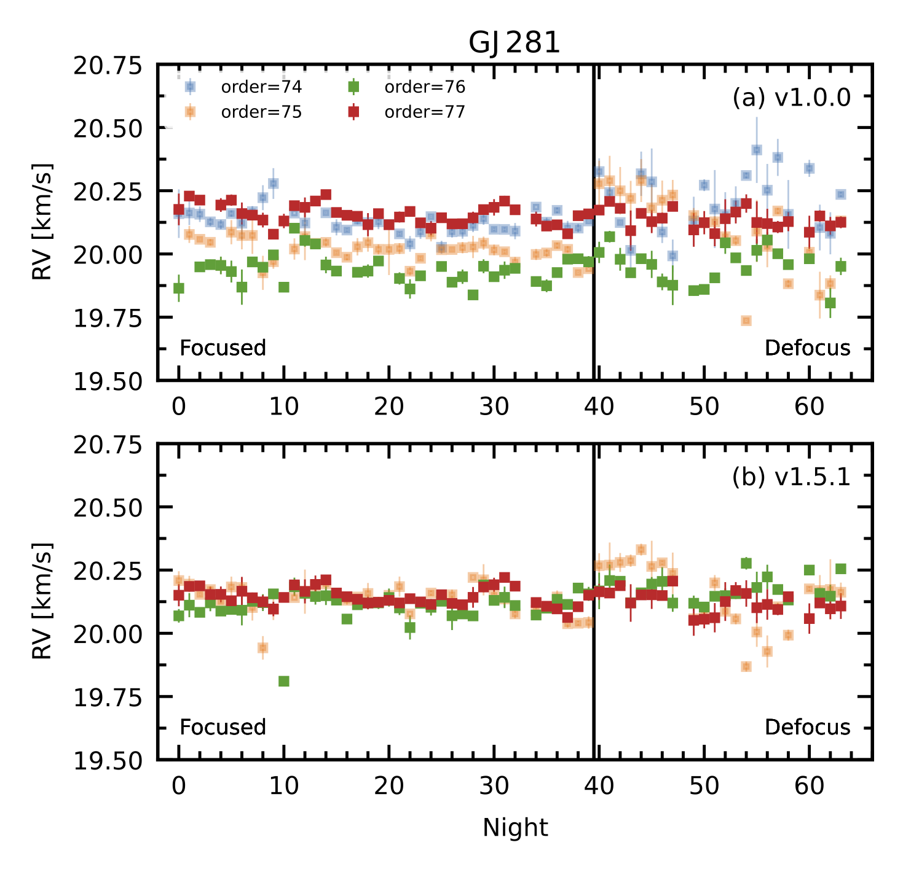

# What's new in v1.5.1?

## V1.0.x / The Problem:

**IGRINS RV v1.0.x** could only measure relative (not absolute) RVs to the highest possible precisions because, for a given target, RVs derived from different spectral orders were affected by constant zero-point differences (see Figure 6 in Stahl et al. 2021). **IGRINS RV v1.0.x** subtracts out these zero-point offsets, an approach which successfully recovered the planet-induced RV signal for the tau Boo and HD 189733 systems. And users still had the option to run the code in "absolute RV" mode, which sacrificed precision for the sake of preserving absolute RV information.

## The Problem:

Subtracting the zero-point offsets is only reasonable when a given target has many observations, so that the offsets can be estimated accurately. If a target has only a few observations, then the zero-point offset corrections could be wrong.

## The Solution: V1.5.1

**IGRINS RV v1.5.1** almost completely removes the zero-point offset issue in the K band and includes a more robust treatment of offsets in the cases when they remain. Beyond a number of smaller improvements, the biggest change to the pipeline involves the masking of H2O telluric absorption lines during the K band spectrum fitting process, as these lines were skewing the derived wavelength solutions. The upgrade to **v1.5.1** particularly benefits targets with only a handful of observations (less than around 10). 

Below are the order by order RVs for the RV standard, GJ~281.\
(a) shows results from **IGRINS RV v1.0.0**, and (b) shows results from **IGRINS RV v1.5.1**.

(Tang et al. 2022, in prep.)

For a more detailed description of the performance differences of **IGRINS RV v1.5.1**, see Tang et al. 2022 (in prep.). 

## Remaining Issues

Though **IGRINS RV v1.5.1** almost completely removes the zero-point offset issue in the K band, it fails to do so in the H band. The code can still be run in the H band, and the effect of the zero-point order offsets on the estimated RVs will be taken into account in the RV uncertainties. But the precision will be worse, from about 30 m/s in v1.0.x to about 45 m/s in v1.5.1 (in other words, **IGRINS RV v1.0.x** was in some cases underestimating uncertainties). Future work will aim to reduce the zero-point offsets in the H band as well; for now, **IGRINS RV v1.5.1** can still deliver accurate RVs for H band data -- just (for some targets) at coarser precision than **v1.0.x** would have unrealistically reported.

